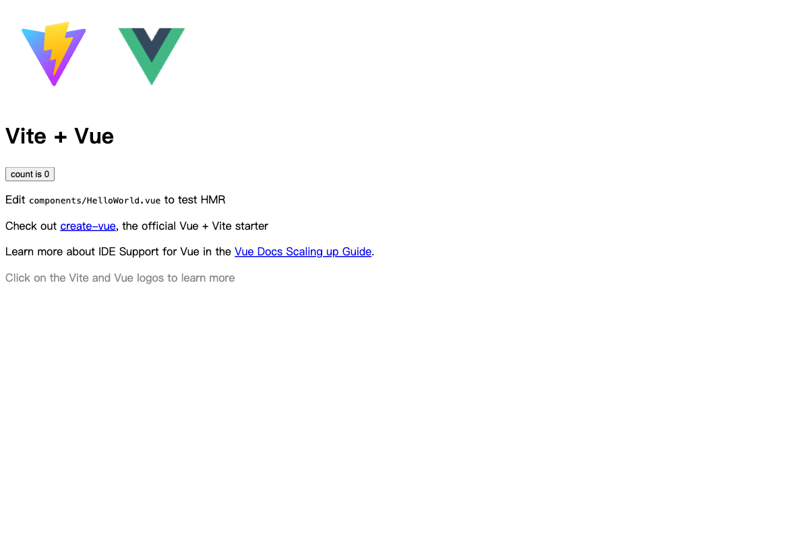

<!--
 * @Date: 2025-06-02 19:41:09
 * @LastEditors: CZH
 * @LastEditTime: 2025-06-03 09:16:25
 * @FilePath: /AI编程与MCP使用/voice-chat-app/README.md
-->
# 🎤 FunASR 语音控制应用

基于 Vue3 + TypeScript 构建的语音控制应用，通过自然语言指令操作页面元素。集成 FunASR 实现实时语音识别，结合 LMStudio 本地大模型实现自然语言到 DOM 操作的转换。

## ✨ 核心功能

- **实时语音识别**：通过 FunASR 实现高精度语音转文本
- **自然语言指令**：将语音指令转换为 DOM 操作（创建/修改/删除元素）
- **双向对话界面**：用户与 AI 的聊天式交互
- **动态元素查询**：实时获取页面元素状态辅助指令生成
- **本地模型推理**：通过 LMStudio 运行 Qwen 系列模型

## 🛠 技术栈

| 类别      | 技术                    |
| --------- | ----------------------- |
| 前端框架  | Vue 3 + Composition API |
| 开发工具  | Vite + TypeScript       |
| UI 组件   | Element Plus            |
| 语音处理  | Recorder.js + FunASR    |
| HTTP 请求 | Axios                   |
| 本地推理  | LMStudio + Qwen 模型    |

## ⚙️ 环境配置

### 前置依赖
1. Node.js v18+
2. FunASR 语音识别服务
3. LMStudio 本地模型服务

### FunASR 服务部署
```bash
# 参考官方部署指南
git clone https://github.com/alibaba-damo-academy/FunASR.git
cd FunASR/runtime/websocket/build
bash run_server.sh
```

### LMStudio 配置
1. 下载 [Qwen 系列模型](https://huggingface.co/Qwen)
2. 在 LMStudio 加载模型并启动本地服务（默认端口 1234）

## 🚀 运行步骤

```bash
nvm use 16

# 安装依赖
npm install

# 启动开发服务器
npm run dev
```

## 📸 应用截图

| 主界面                                                                                  | 语音识别                                                                          |
| --------------------------------------------------------------------------------------- | --------------------------------------------------------------------------------- |
|  |  |

## 📚 学习资源

- [FunASR 官方文档](https://alibaba-damo-academy.github.io/FunASR/)
- [Vue 3 官方指南](https://vuejs.org/guide/introduction.html)
- [LMStudio 使用教程](https://lmstudio.ai/docs)
- [Qwen 模型卡片](https://huggingface.co/Qwen)
